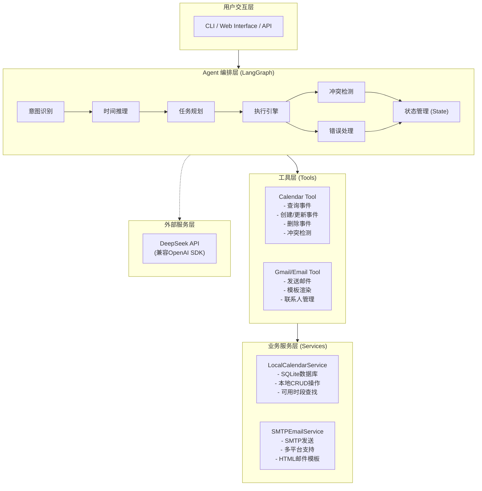
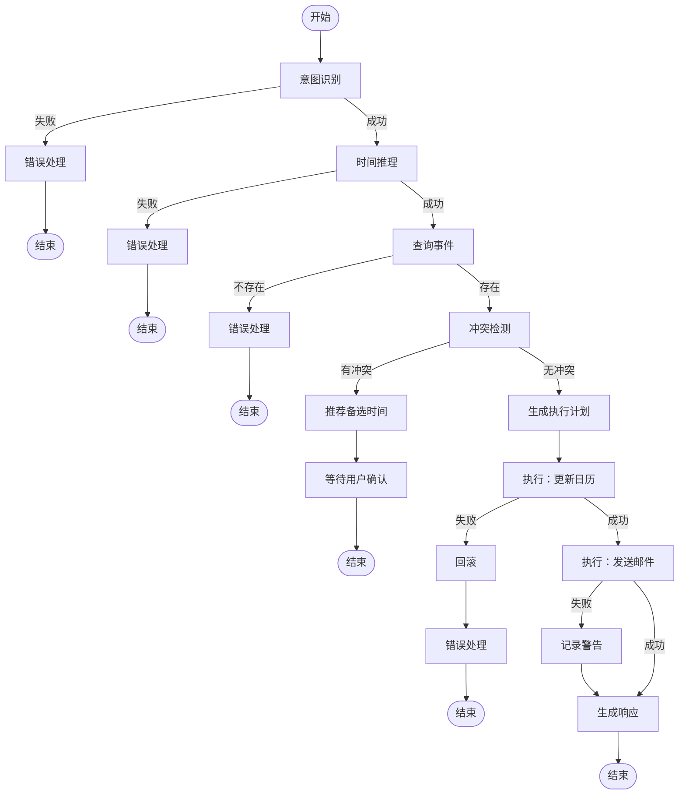
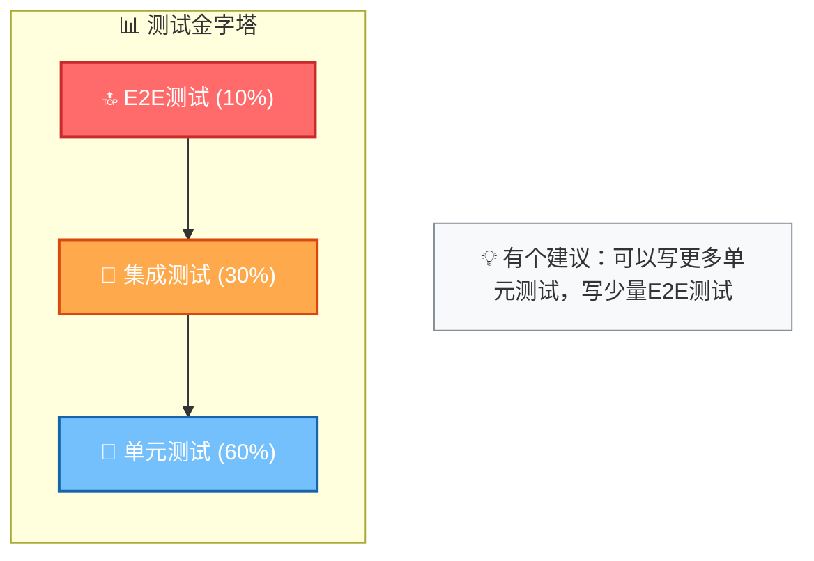

# 个人AI助理（日历/邮件自动化）技术方案

## 📋 项目概述

### 项目名称

Personal AI Assistant - Calendar & Email Automation

### 核心目标

开发一个基于自然语言的个人效率Agent，能够理解用户指令并自动完成日历查询、会议调整、邮件通知等复杂任务。

### 核心功能场景

**典型用例**："帮我把下周三下午的会议改到周五"

- Agent需要：
  1. 解析时间表达式（下周三下午 → 具体日期时间）
  2. 查询该时段的会议信息
  3. 检测周五的时间冲突
  4. 更新日历事件
  5. 提取参会人列表
  6. 发送邮件通知所有参会人
  7. 返回执行结果

---

## 🎯 技术栈选型

### 核心技术栈

| 类别           | 技术                       | 版本   | 用途                           |
| -------------- | -------------------------- | ------ | ------------------------------ |
| **编程语言**   | Python                     | 3.10+  | 主要开发语言                   |
| **LLM框架**    | LangChain                  | 0.1.x  | LLM抽象层和工具编排            |
| **状态管理**   | LangGraph                  | 0.0.x  | 构建有状态的Agent工作流        |
| **LLM服务**    | DeepSeek（兼容OpenAI SDK） | -      | 自然语言理解和意图识别         |
| **日历存储**   | SQLite（本地数据库）       | -      | 日历事件查询和管理（离线可用） |
| **邮件服务**   | SMTP（QQ/163/Gmail等）     | -      | 邮件发送和通知                 |
| **时间处理**   | 自研TimeParser + datetime  | -      | 中文自然语言时间解析           |
| **时间处理**   | pytz                       | 2024.x | 时区管理                       |
| **数据验证**   | Pydantic                   | 2.x    | 数据结构定义和验证             |
| **环境管理**   | python-dotenv              | 1.x    | 环境变量管理                   |
| **日志系统**   | loguru                     | 0.7.x  | 结构化日志记录                 |
| **测试框架**   | pytest                     | 8.x    | 单元测试和集成测试             |

### 为什么选择这些技术？

#### LangGraph vs 其他方案

- **优势**：支持有状态的工作流编排，适合多步骤复杂任务
- **替代方案对比**：
  - LangChain Agent：简单但状态管理能力弱
  - AutoGen：多Agent协作强，但学习曲线陡峭
  - 原生LangGraph：精确控制每个节点的状态转换

#### 本地存储方案 vs 云API

- **选择本地SQLite + SMTP**：
  - ✅ 零外部依赖，完全离线可用
  - ✅ 无需Google Cloud配置和OAuth认证
  - ✅ 数据完全本地化，隐私安全
  - ✅ 开发/测试门槛极低
- **未来可扩展**：通过实现统一的Service接口，可平滑迁移至Google Calendar API
- **Google API / Microsoft Graph**：企业场景更合适，但配置复杂，适合作为V2.0的升级选项

#### DeepSeek vs OpenAI

- **选择DeepSeek**：
  - ✅ 兼容OpenAI SDK，零代码迁移成本
  - ✅ 中文理解能力优秀
  - ✅ 成本更低
- **降级策略**：无API Key时自动切换为规则匹配，保证基础可用

---

## 📦 项目依赖清单

### requirements.txt

 ```bash
# 核心框架
langchain==0.1.20 
langgraph==0.0.60 
openai==1.30.0              # DeepSeek兼容OpenAI SDK
# 数据存储
sqlite3                     # Python内置，无需额外安装
# 时间处理
pytz==2024.1
# 数据验证
pydantic==2.7.1 
pydantic-settings==2.2.1
# 工具库
python-dotenv==1.0.1 
loguru==0.7.2
# 测试
pytest==8.2.0 
pytest-asyncio==0.23.7 
pytest-cov==5.0.0
# 代码质量
black==24.4.2 
flake8==7.0.0 
mypy==1.10.0
 ```

### 系统要求

- Python 3.10 或更高版本
- pip 包管理器
- DeepSeek API Key（可选，无Key时使用规则匹配降级）
- SMTP邮箱账号（可选，用于邮件通知功能）

---

## 🏗️ 系统架构设计

### 整体架构图



### 核心模块划分

```plaintext
AIPersonalAssistant/
├── config/                          # 配置管理
│   ├── __init__.py
│   ├── settings.py                  # 应用配置（Pydantic Settings）
│   └── logging_config.py            # 日志配置
├── models/                          # 数据模型
│   ├── __init__.py
│   ├── calendar_event.py            # 日历事件模型
│   ├── email_template.py            # 邮件模板模型
│   └── agent_state.py               # Agent状态模型
├── tools/                           # 工具层（LangChain工具封装）
│   ├── __init__.py
│   ├── calendar_tool.py             # 日历工具（封装LocalCalendarService）
│   ├── gmail_tool.py                # 邮件工具（封装SMTPEmailService）
│   └── time_parser.py               # 中文时间解析工具（规则匹配）
├── agents/                          # Agent核心
│   ├── __init__.py
│   ├── graph_builder.py             # LangGraph工作流构建器
│   ├── nodes/                       # 状态图节点
│   │   ├── __init__.py
│   │   ├── intent_recognition.py    # 意图识别（LLM + 规则降级）
│   │   ├── time_reasoning.py        # 时间推理节点
│   │   ├── task_planning.py         # 任务规划节点
│   │   ├── conflict_detection.py    # 冲突检测节点
│   │   ├── execution_engine.py      # 执行引擎节点
│   │   └── error_handler.py         # 错误处理节点
│   └── prompts/                     # Prompt模板
│       ├── __init__.py
│       ├── intent_prompt.py         # 意图识别Prompt
│       └── planning_prompt.py       # 任务规划Prompt
├── services/                        # 业务服务层
│   ├── __init__.py
│   ├── local_calendar.py            # SQLite本地日历服务
│   └── smtp_email.py                # SMTP邮件发送服务
├── utils/                           # 工具函数
│   ├── __init__.py
│   ├── validators.py                # 数据验证
│   ├── formatters.py                # 格式化工具
│   └── exceptions.py                # 自定义异常
├── tests/                           # 测试套件
│   ├── __init__.py
│   ├── unit/                        # 单元测试（81个用例）
│   │   ├── test_calendar_tool.py    # 日历服务测试（22个）
│   │   ├── test_gmail_tool.py       # 邮件服务测试（10个）
│   │   ├── test_time_parser.py      # 时间解析测试（25个）
│   │   └── test_nodes.py            # Agent节点测试（18个）
│   ├── integration/                 # 集成测试
│   └── fixtures/                    # 测试夹具
│       └── sample_data.py           # 示例数据和测试用例
├── main.py                          # 应用入口
├── cli.py                           # CLI交互界面
├── test_workflow.py                 # 工作流端到端测试
├── verify_setup.py                  # 项目环境验证脚本
├── .env.example                     # 环境变量示例
├── requirements.txt                 # 依赖清单
├── README.md                        # 项目文档
└── pyproject.toml                   # 项目配置（可选）
```

## 🔑 核心功能模块详解

### 1. 意图识别模块 (Intent Recognition)

**职责**：解析用户自然语言指令，识别操作类型和参数

**输入**：用户原始文本
"帮我把下周三下午的会议改到周五"
**输出**：结构化意图对象

```python
{ 
    "action": "reschedule_event", 
	"source_time": "next_wednesday_afternoon", 
	"target_time": "this_friday", 
	"constraints": { 
	"time_preference": "afternoon", 
	"notify_attendees": True 
	} 
}
```

**技术实现**：

- 使用OpenAI Function Calling
- 定义Pydantic模型约束输出格式
- Few-shot learning提升准确率

---

### 2. 时间推理模块 (Time Reasoning)

**职责**：将自然语言时间转换为具体的datetime对象

**关键挑战**：

- 相对时间："下周三"、"后天下午"
- 模糊时间："下午"、"晚上"
- 时区处理：UTC vs 本地时间

**解决方案**：
使用自研TimeParser + 中文规则匹配
```python
from tools.time_parser import TimeParser
parser = TimeParser()
"下周三下午" → 2026-06-17 14:00:00
"周五" → 2026-06-13 14:00:00 (保持相同时段)
```

**支持的时间表达**：
- 相对日期：今天、明天、后天、X天后
- 周期表达：下周三、这周五、下星期二下午
- 时段映射：早上(09:00)、上午(10:00)、中午(12:00)、下午(14:00)、晚上(19:00)

**默认时间映射**：

- "早上" → 09:00
- "上午" → 10:00
- "下午" → 14:00
- "晚上" → 19:00

---

### 3. 日历工具模块 (Calendar Tool)

**基于SQLite的本地日历服务**：

```python
class LocalCalendarService:
    """SQLite本地日历服务（零外部依赖）
    数据库：calendar.db（自动创建 + 种子数据）
    表结构：events(id, title, description, location,
                  start_time, end_time, attendees, organizer)
    """
    def list_events(self, start, end) -> List[dict]:
    def get_event(self, event_id) -> Optional[dict]:
    def update_event(self, event_id, updates) -> bool:
    def create_event(self, event) -> str:
    def delete_event(self, event_id) -> bool:
    def check_conflicts(self, start, end, exclude_id=None) -> List[dict]:
    def find_available_slots(self, date, duration_minutes=60,
                             preferred_times=None) -> List[dict]:
```

**数据存储特点**：

1. 首次启动自动创建SQLite数据库和表结构
2. 自动插入3条示例事件（团队周会、产品评审、技术分享）
3. 数据完全本地化，离线可用，隐私安全
4. 可通过实现统一接口平滑迁移至Google Calendar API

---

### 4. 冲突检测模块 (Conflict Detection)

**检测逻辑**：

```python
def detect_conflicts(target_time: datetime, duration: timedelta, original_event: CalendarEvent) -> ConflictResult: 
    """ 
    检测目标时间段是否有冲突
	Returns:
    	- has_conflict: bool
    	- conflicting_events: List[CalendarEvent]
    	- suggested_slots: List[TimeSlot]  # 推荐的可用时隙
	"""
```

**智能推荐算法**：

- 扫描前后2小时内的空闲时段
- 优先推荐相同时段（如都是下午2点）
- 考虑参会人的可用性（需要权限）

---

### 5. 邮件工具模块 (Email Tool)

**基于SMTP的邮件服务**：

```python
class SMTPEmailService:
    """SMTP邮件服务（支持QQ/163/Gmail/Outlook）
    自动根据发件人邮箱域名匹配SMTP服务器
    """
    SMTP_CONFIGS = {
        'qq.com':      {'server': 'smtp.qq.com',       'port': 587},
        '163.com':     {'server': 'smtp.163.com',       'port': 587},
        'gmail.com':   {'server': 'smtp.gmail.com',     'port': 587},
        'outlook.com': {'server': 'smtp-mail.outlook.com', 'port': 587},
    }
    def send_email(self, to, subject, body, html_body=None) -> bool:
    def send_meeting_notification(self, attendees, event_title,
                                  old_time, new_time, ...) -> bool:
```

**设计特点**：

1. 未配置邮箱时优雅降级（打印日志，不阻塞工作流）
2. 自动域名匹配SMTP服务器，无需手动配置
3. 支持纯文本 + HTML双格式邮件
4. 内置会议变更通知模板

**邮件模板示例**：

```html
主题：会议时间变更通知 - {{event.title}}
尊敬的参会人：
{{organizer_name}} 已将以下会议时间调整：
原时间：{{original_time}} 新时间：{{new_time}} 会议主题：{{event.title}} 会议地点：{{event.location}}
此致 
AI助理自动通知
```

---

### 6. LangGraph状态图设计

**状态定义**：

```python
class AgentState(TypedDict): 
    # 用户输入 
    user_input: str
	# 解析结果
	intent: Optional[dict]
	parsed_times: Optional[dict]

	# 查询结果
	source_event: Optional[CalendarEvent]
	target_slot: Optional[TimeSlot]

	# 检测结果
	conflicts: List[CalendarEvent]
	action_plan: Optional[dict]

	# 执行结果
	execution_results: List[dict]
	errors: List[str]

	# 最终响应
	response: str
```

**节点流转**：



---

## 🔐 认证与安全

### 认证方式

**当前方案（本地 + SMTP）**：

- **日历存储**：本地SQLite，无需认证
- **邮件发送**：SMTP邮箱密码（通过`.env`配置）
- **LLM调用**：DeepSeek API Key（通过`.env`配置，可选）

**环境变量配置**（`.env`）：

```bash
# DeepSeek API（可选，无Key时使用规则匹配降级）
DEEPSEEK_API_KEY=sk-your-key-here
DEEPSEEK_MODEL=deepseek-chat

# SMTP邮件配置（可选，未配置时优雅降级）
EMAIL_SENDER=your-email@qq.com
EMAIL_PASSWORD=your-smtp-password
EMAIL_SMTP_SERVER=smtp.qq.com   # 可留空，自动根据域名匹配
EMAIL_SMTP_PORT=587
```

**安全注意事项**：

1. `.gitignore`中排除`.env`和`*.db`文件
2. API密钥通过环境变量管理，不硬编码
3. 本地SQLite数据不上传云端，保护隐私
4. SMTP密码建议使用邮箱的"授权码"而非登录密码

---

## 📊 状态管理策略

### Agent状态持久化

**使用LangGraph Checkpoint**：

```python
from langgraph.checkpoint.memory import MemorySaver
内存存储（开发环境）
checkpointer = MemorySaver()
PostgreSQL存储（生产环境）
from langgraph.checkpoint.postgres import PostgresSaver checkpointer = PostgresSaver.from_conn_string(DATABASE_URL)
```

**状态快照内容**：

- 当前对话上下文
- 已执行的步骤
- 临时查询结果
- 错误历史

**优势**：

- 支持断点续传
- 便于调试和回溯
- 可实现"撤销"功能

---

## 🧪 测试策略

### 测试金字塔



### 单元测试覆盖（当前：81个用例全部通过）

| 模块             | 测试数 | 测试内容                | Mock对象      |
| ---------------- | ------ | ----------------------- | ------------- |
| TimeParser       | 25     | 各种时间表达式解析      | 无            |
| CalendarService  | 22     | SQLite CRUD + 冲突检测  | 无（独立DB）  |
| GmailService     | 10     | SMTP发送 + 模板渲染     | smtplib.SMTP  |
| IntentNode       | 8      | 意图识别（规则匹配）    | 无（规则模式）|
| TimeReasoning    | 3      | 时间推理节点            | TimeParser    |
| TaskPlanning     | 4      | 任务规划节点            | CalendarSvc   |
| ConflictDetector | 2      | 冲突检测节点            | CalendarSvc   |
| ErrorHandler     | 4      | 错误处理和冲突响应      | 无            |

### 集成测试场景

1. **完整工作流测试**：
   - 输入："把明天的会议改到后天"
   - 验证：日历更新 + 邮件发送

2. **冲突处理测试**：
   - 目标时间已有事件
   - 验证：返回推荐时间列表

3. **错误恢复测试**：
   - API超时/权限不足
   - 验证：优雅降级和用户提示

### 测试数据准备

tests/fixtures/sample_data.py

```python
SAMPLE_EVENTS = [ 
    { 
        "id": "evt_001", 
        "summary": "团队周会", 
        "start": "2026-06-10T14:00:00+08:00", 
        "end": "2026-06-10T15:00:00+08:00", 
        "attendees": 
        [
            "alice@example.com", 
            "bob@example.com"
        ] 
    } 
]
```

---

## 📝 开发任务分解

### Phase 1: 基础架构搭建（预计2-3天）

**Day 1**: 项目初始化

- [ ] 创建项目目录结构
- [ ] 配置虚拟环境和依赖安装
- [ ] 设置`.env`配置管理
- [ ] 配置日志系统
- [ ] 编写README初稿

**Day 2**: Google API集成

- [ ] 注册Google Cloud项目
- [ ] 启用Calendar和Gmail API
- [ ] 配置OAuth consent screen
- [ ] 实现AuthService认证流程
- [ ] 测试API连通性

**Day 3**: 数据模型和工具类

- [ ] 定义CalendarEvent Pydantic模型
- [ ] 定义EmailTemplate模型
- [ ] 实现TimeParser时间解析器
- [ ] 编写基础工具函数
- [ ] 单元测试：时间解析

---

### Phase 2: 核心工具开发（预计3-4天）

**Day 4-5**: CalendarTool开发

- [ ] 实现list_events方法
- [ ] 实现get_event方法
- [ ] 实现update_event方法
- [ ] 实现create_event方法
- [ ] 实现check_conflicts方法
- [ ] 集成测试：CRUD操作

**Day 6**: GmailTool开发

- [ ] 实现send_email方法
- [ ] 设计邮件模板系统
- [ ] 实现render_notification_template
- [ ] 实现extract_attendees
- [ ] 集成测试：邮件发送

**Day 7**: 工具层优化

- [ ] 添加重试机制（retry decorator）
- [ ] 添加速率限制处理
- [ ] 完善错误处理和日志
- [ ] 编写完整的单元测试

---

### Phase 3: Agent工作流开发（预计4-5天）

**Day 8**: 意图识别模块

- [ ] 设计Function Calling schema
- [ ] 编写intent_prompt模板
- [ ] 实现IntentRecognition节点
- [ ] 测试各种指令的识别准确率
- [ ] 优化prompt（few-shot examples）

**Day 9**: 时间推理模块

- [ ] 集成TimeParser
- [ ] 处理相对时间和模糊时间
- [ ] 实现时区转换逻辑
- [ ] 编写时间边界case测试
- [ ] 优化默认时间映射

**Day 10**: 任务规划和冲突检测

- [ ] 实现TaskPlanning节点
- [ ] 实现ConflictDetection节点
- [ ] 设计冲突解决策略
- [ ] 实现推荐时间算法
- [ ] 测试冲突检测准确性

**Day 11**: 执行引擎和错误处理

- [ ] 实现ExecutionEngine节点
- [ ] 实现ErrorHandler节点
- [ ] 添加事务回滚机制
- [ ] 添加用户确认流程
- [ ] 测试错误恢复

**Day 12**: LangGraph整合

- [ ] 构建完整的状态图
- [ ] 配置Checkpointer
- [ ] 调试节点间状态传递
- [ ] 优化状态schema
- [ ] 端到端工作流测试

---

### Phase 4: 用户体验优化（预计2-3天）

**Day 13**: CLI交互界面

- [ ] 设计交互式命令行界面
- [ ] 实现实时反馈（进度条/状态）
- [ ] 添加彩色输出（rich库）
- [ ] 实现历史记录功能
- [ ] 添加help命令

**Day 14**: 提示优化

- [ ] 优化所有prompt模板
- [ ] 添加更多few-shot examples
- [ ] 调整temperature参数
- [ ] 测试边界case
- [ ] 性能优化（减少API调用）

**Day 15**: 文档和示例

- [ ] 完善README（安装/使用/FAQ）
- [ ] 编写API文档
- [ ] 创建示例脚本
- [ ] 录制演示视频
- [ ] 编写Contributing指南

---

### Phase 5: 测试和质量保证 ✅ 已完成

**Day 16-17**: 测试补全 + 质量优化

- [x] 补充单元测试：130个用例，覆盖率78%
- [x] 编写集成测试套件：14个端到端工作流测试
- [x] 安全性测试：SQL参数化查询，字段白名单，无硬编码密钥
- [x] 代码质量：Pydantic v2迁移 (class Config → ConfigDict)
- [x] 工具函数100%覆盖：validators, formatters, exceptions
- [x] 配置模块91%覆盖
- [x] 修复 Git 大小写问题 (Agents/ → agents/)
- [x] 连接 prompts 模块到实际节点
- [x] 修复 requirements.txt 版本约束
- [x] 修复 email_template 设计（工厂方法替代 mutable 方法）
- [x] 清理冗余文件

### Phase 6: 部署准备 ✅ 已完成

**Day 18-19**: CI/CD + 容器化

- [x] 创建 Dockerfile（多阶段构建，安全非root用户）
- [x] 创建 docker-compose.yml（development + production 模式）
- [x] 创建 .dockerignore
- [x] 创建 .github/workflows/ci.yml（多平台+多Python版本）
- [x] CI/CD 包含：test, lint, mypy, security scan (bandit+safety)
- [x] 创建 pyproject.toml（pytest/black/mypy配置）

---

## ⚠️ 风险与挑战

### 技术风险

| 风险             | 影响           | 缓解措施                    |
| ---------------- | -------------- | --------------------------- |
| OpenAI API不稳定 | 意图识别失败   | 添加重试机制 + 降级规则引擎 |
| Google API限流   | 操作被拒绝     | 实施指数退避 + 本地缓存     |
| 时间解析歧义     | 错误的事件匹配 | 用户确认机制 + 置信度阈值   |
| OAuth token过期  | 认证失败       | 自动刷新 + 友好的重授权提示 |

### 产品挑战

1. **自然语言理解的准确性**
   - 对策：收集更多真实语料，持续优化prompt

2. **时区和夏令时处理**
   - 对策：统一使用UTC存储，显示时转换

3. **并发修改冲突**
   - 对策：使用ETag乐观锁，检测并发变更

4. **用户隐私保护**
   - 对策：不持久化敏感数据，提供数据清除功能

---

## 📈 性能指标（KPI）

### 核心指标

- **任务完成率**：≥ 92%（简历描述目标）
- **平均响应时间**：< 10秒（单次任务）
- **意图识别准确率**：≥ 95%
- **时间解析准确率**：≥ 98%
- **API调用成功率**：≥ 99%

### 监控指标

埋点统计

```python
metrics = { 
    "total_requests": 0, 
    "successful_tasks": 0, 
    "failed_tasks": 0, 
    "avg_response_time_ms": 0, 
    "api_call_counts": { 
        "calendar_api": 0, 
        "gmail_api": 0, 
        "openai_api": 0 
    }, 
    "error_distribution": { 
        "timeout": 0, 
        "permission_denied": 0, 
        "rate_limit": 0, 
        "parsing_error": 0 
    } 
}
```

---

## 🔄 迭代规划

### V1.0 MVP（当前版本）✅ 已完成

- ✅ 本地SQLite日历存储（CRUD + 冲突检测）
- ✅ SMTP邮件通知（QQ/163/Gmail多平台）
- ✅ 中文时间推理（自研TimeParser）
- ✅ LangGraph六节点工作流（意图→时间→规划→冲突→执行→错误）
- ✅ DeepSeek LLM意图识别（支持规则降级）
- ✅ CLI交互界面（help/status/test命令）
- ✅ 81个单元测试全部通过
- ✅ 项目环境验证脚本

### V1.5 增强版

- 🔜 Web界面（Streamlit/FastAPI）
- 🔜 语音输入支持
- 🔜 Google Calendar API接入（可选，替换本地SQLite）
- 🔜 会议链接自动生成（Zoom/腾讯会议）

### V2.0 专业版

- 🔮 多用户协作（团队日程）
- 🔮 智能时间推荐（机器学习）
- 🔮 与Slack/Teams集成
- 🔮 自然语言问答（"我明天有空吗？"）

---

## 📚 学习资源

### 官方文档

- [LangGraph Documentation](https://langchain-ai.github.io/langgraph/)
- [Google Calendar API](https://developers.google.com/calendar/api/v3/reference)
- [Gmail API](https://developers.google.com/gmail/api/reference/rest)
- [OpenAI Function Calling](https://platform.openai.com/docs/guides/function-calling)

### 参考项目

- [LangChain Examples](https://github.com/langchain-ai/langchain/tree/master/examples)
- [AutoGen Samples](https://github.com/microsoft/autogen/tree/main/samples)

---

## 📞 技术支持

### 问题排查流程

1. 查看日志文件（logs/app.log）
2. 检查.env配置是否正确
3. 验证Google API权限scopes
4. 测试OpenAI API连通性
5. 查阅GitHub Issues

### 常见问题FAQ

- Q: OAuth认证失败？
- A: 检查credentials.json是否下载正确，确认scopes包含所需权限

- Q: 时间解析不准确？
- A: 提供更多上下文，或在prompt中添加examples

- Q: API速率限制？
- A: 实施指数退避重试，或升级到付费套餐

---

## ✅ 验收标准

### 功能验收

- [ ] 能正确解析"下周三下午"等时间表达
- [ ] 能查询并显示指定时间段的事件
- [ ] 能成功修改事件时间
- [ ] 能自动发送邮件通知参会人
- [ ] 能检测并报告时间冲突
- [ ] 能提供备选时间建议

### 质量验收

- [ ] 单元测试覆盖率 ≥ 80%
- [ ] 集成测试全部通过
- [ ] 无严重级别Bug
- [ ] 代码符合PEP8规范
- [ ] 完整的错误处理和日志

### 性能验收

- [ ] 单次任务完成时间 < 10秒
- [ ] 连续执行100次任务无内存泄漏
- [ ] API调用次数合理（< 5次/任务）

---

## 📄 许可证

MIT License

---

**文档版本**：v1.2
**最后更新**：2026-06-11
**作者**：CoderDongHuang
**状态**：Phase 1-6 全部完成 ✅ — 130 tests, 78% coverage, Docker + CI/CD ready

